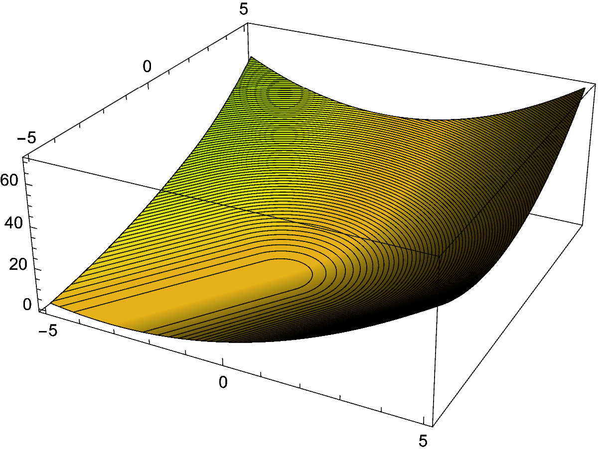

# surMSE
A loss function @PyTorch, that allows the target to be exceeded in the target direction.


## 思路说明
允许输入与目标方向相同,但模长比目标大.此时损失为零. 
因为神经网络经常表现出输出稍微不达目标的特性,通过减弱使输出接近零的梯度,尝试缓解这个问题.

## Install
```bash
pip install surMSE
```

## Use
```python
from surMSE import surMSE
...
loss=surMSE(input,target,dim=None,scale=True,eps=1e-8,meanOut=True,haveBatch=True)
```

dim表示在哪些维度上计算损失,一般开启除Batch维之外的全部维度.设定为None则自动计算.      
  dim=None,haveBatch=True时,自动排除首维.dim=None,haveBatch=False时在全部维度上计算.      
scale控制是否根据target是模长控制对应样本损失的增益,如果开启,将通过target模长给损失加权.    
meanOut控制是否在返回前使用平均的方法合并"dim"参数指定外的剩余维度.如果不开启,取决于数据维度和dim设置,返回的tensor将不一定只有一个元素.
  
